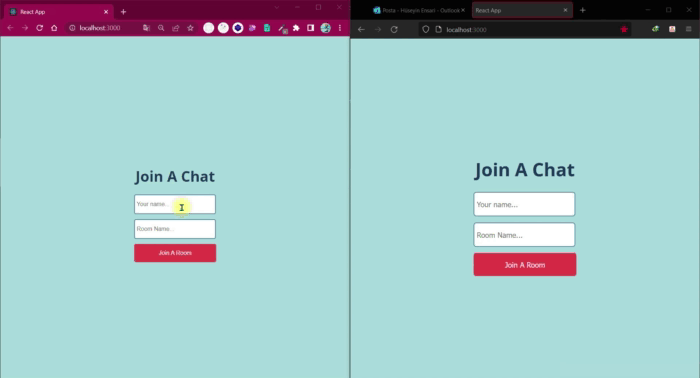

Fullstack Chat App
---

A chat app that I made using socket.io. Made in Node.js and React.



To try locally
- Clone the repo
- Create .env file in client and server folders.

to the .env file in the server
```
CLIENT__URL=http://localhost:3000
```

to the .env file in the client
```
REACT_APP_SERVER_URL=http://localhost:4000
```

- Run `yarn` command in client. Then run `yarn start`.
- Run `yarn` command for server as well. Then run `yarn dev`.
- Start messaging.